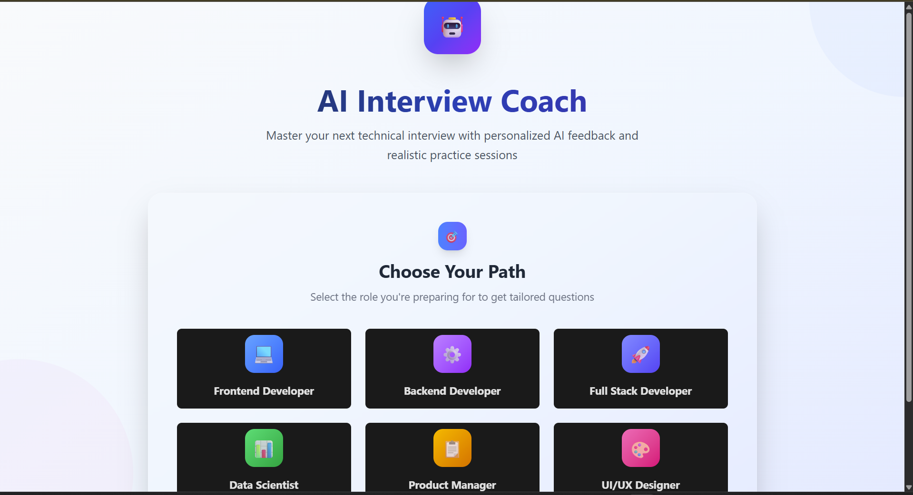
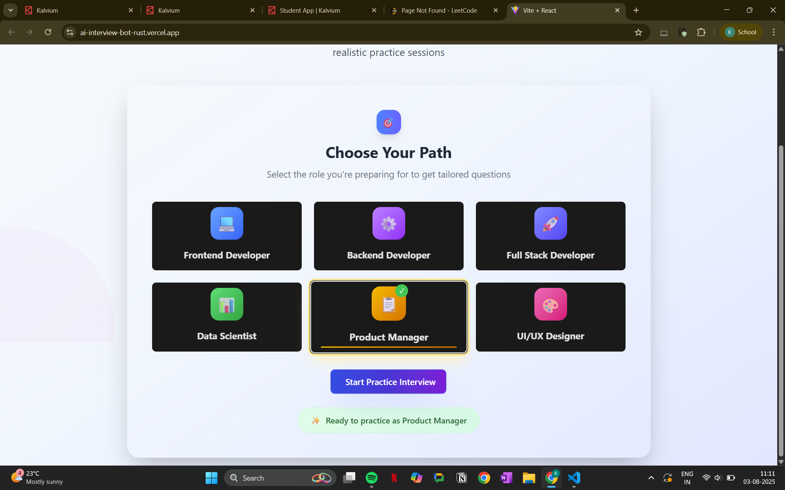
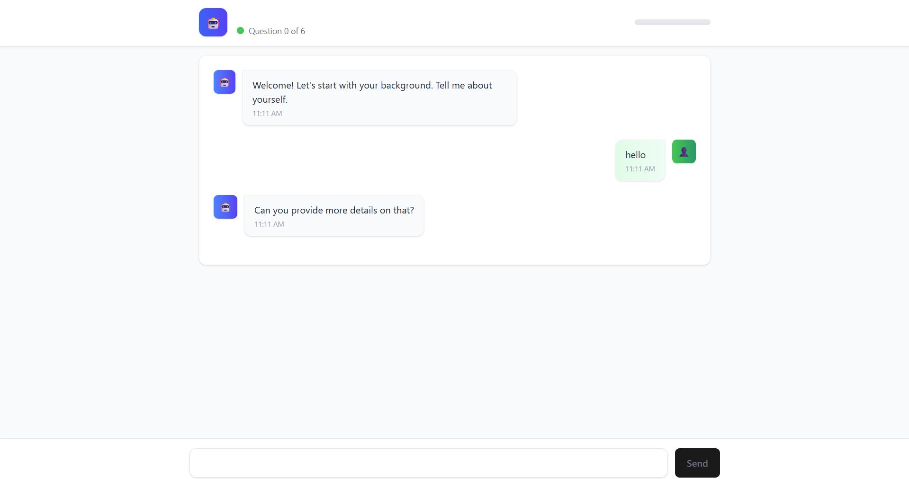

# AI Interview Bot

An intelligent, role-specific interview automation system powered by Google Gemini API. The AI Interview Bot simulates a real-time technical interviewer, asks context-aware questions, analyzes responses, and provides detailed feedback — making it ideal for technical hiring platforms, educational tools, and developer upskilling.





---

##  Features

*  Starts a professional interview session tailored to a specific job role
*  Continuously evaluates candidate responses and follows up with relevant questions
*  Generates detailed, structured feedback after the interview
*  Environment-based configuration and centralized API key management
*  Powered by [Gemini 2.5 Flash API](https://ai.google.dev/) for fast and reliable language generation

---

##  Tech Stack

* **Backend**: Node.js, Express
* **AI Integration**: Gemini API (Google Generative Language API)
* **Environment Management**: dotenv
* **HTTP Client**: node-fetch
* **CORS-enabled**: For secure frontend integration
* **Logging**: Standardized and environment-aware server logs

---

##  Project Structure

```
AI-Interview-Bot/
├── routes/
│   └── interview.js       # API route handlers
├── services/
│   └── geminiService.js   # Gemini API logic
├── .env                   # Environment variables (excluded from repo)
├── server.js              # Entry point
└── README.md              # Project documentation
```

---

## API Endpoints

### 1. Start Interview

**POST** `/api/interview/start`
Starts a new interview session based on the role.

**Body:**

```json
{
  "role": "Frontend Developer"
}
```

**Response:**

```json
{
  "success": true,
  "message": "<AI's welcome and first question>",
  "questionNumber": 1
}
```

---

### 2. Continue Interview

**POST** `/api/interview/continue`
Continues the interview with follow-up questions based on candidate responses.

**Body:**

```json
{
  "role": "Frontend Developer",
  "history": "<previous Q&A>",
  "answer": "Candidate's latest response"
}
```

**Response:**

```json
{
  "success": true,
  "message": "<AI feedback + next question>"
}
```

---

### 3. Generate Feedback

**POST** `/api/interview/feedback`
Generates structured performance feedback after the interview.

**Body:**

```json
{
  "role": "Frontend Developer",
  "history": "<entire interview history>"
}
```

**Response:**

```json
{
  "success": true,
  "feedback": "<Structured interview evaluation>"
}
```

---

## ⚙️ Setup & Installation

1. **Clone the repository**

```bash
git clone https://github.com/your-username/AI-Interview-Bot.git
cd AI-Interview-Bot
```

2. **Install dependencies**

```bash
npm install
```

3. **Configure Environment**
   Create a `.env` file and add:

```env
PORT=5000
GEMINI_API_KEY=your_google_gemini_api_key_here
NODE_ENV=development
```

4. **Start the server**

```bash
npm start
```

Server will run at: `http://localhost:5000`

---


## DEPLOYMENT LINK
- frontend: https://ai-interview-bot-rust.vercel.app/
- backend: https://ai-interview-bot-ywme.onrender.com

